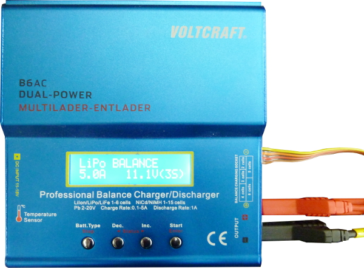
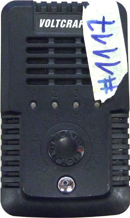
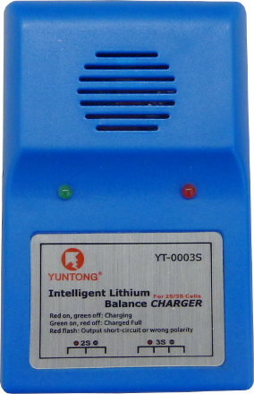

Akku Doku
*********

Laden von Akkus
===============

.. warning::
    Die Akkus haben unterschiedliche Stromstärken mit denen sie geladen werden
    dürfen. Viele unserer Akkus verkraften 6.6A, aber einige auch nur 3A
    Ladestrom!

Voltcraft B6AC
--------------

Unser bestes Ladegerät; kann als einziges den Ladezustand von Akkus anzeigen und
ggf. auch Akkus entladen.

* Akku auf Beschädigung prüfen und in ein Safe-Bag legen
* Balancerkabel einstecken
* Stromkabel einstecken
* *LIPO Balance* auswählen (mit Pfeiltasten)
* *Enter* drücken
* Auf den Akku schauen und entsprechende Ampere Zahl einstellen
* *Enter* gedrückt lassen
* Wenn er 3 Zellen anzeigt, *Enter* drücken

Das Gerät piept, wenn es fertig ist, und hört automatisch auf den Akku zu laden.

* Stromkabel abziehen
* Balancerkabel abziehen

Voltcraft e4
------------

* Akku auf Beschädigung prüfen und in ein Safe-Bag legen
* Akkubeschriftung prüfen, welche Ladegeschwindigkeit erlaubt ist
* Drehregler auf maximal erlaubte Ladegeschwindigkeit stellen
* Stromkabel einstecken
* Balancerkabel einstecken
* Knopf drücken

Bei abgeschlossenem Ladevorgang fängt das Gerät an zu piepen, die Lampen
leuchten grün. Jede LED repräsentiert eine Zelle des Akkus.

* Stromkabel abziehen
* Balancerkabel abziehen

Yuntong Ladegeräte
------------------

Unsere alten Billigladegeräte. Sollten nur im Notfall benutzt werden.

* Balancer Kabel anschließen

Das Gerät leuchtet grün wenn es fertig ist. Ein Ladevorgang mit einem dieser
Geräte kann durchaus einige Stunden dauern.

Lagern von Akkus
================

* Natürlich im Safe-Bag
* Im Schrank liegen volle Akkus rechts, leere oder teilentladene Akkus links und
  Akkus, die derzeit nicht verwendet werden sollen, in der Mitte.
* (Vielleicht werden wir nochmal unterschiedliche Lagerorte einführen,
  damit im Zweifelsfalle nicht alle Akkus auf einmal abbrennen)
* Für die Langzeitlagerung gibt es Anweisungen vom Akkuhersteller. Normalerweise
  werden Akkus bei halber Ladung gelagert und überleben dann recht lange.

Akkutausch (im Betrieb)
=======================

Ein Akku sollte getauscht werden, wenn der Roboter anfängt zu piepen.
Keine Panik, es gibt eine Menge Reserveenergie.

.. warning::
    Die NAO-Netzteile haben einen Stecker, der auch auf unseren Darwin passt.
    Die haben aber 25 Volt statt 12 Volt, wie wir es sonst brauchen!

Vorgehen
--------

* Motor-nutzende Software abstellen, um ungewollte Bewegungen zu vermeiden
  und weniger Strom zu verbrauchen. (ggf. hört dann das Piepen auf).
* Netzteil holen und prüfen, dass es das Richtige ist.
* Roboter flach auf den Bauch legen
* Netzteil einstecken, Wackelkontakte vermeiden, Kabel geschickt verlegen und
  möglichst nicht mehr berühren.
* Neuen Akku im Safe-Bag holen
* Tamya-Verbindungsstecker zwischen Akku und Verbindungsstück trennen.
  **Nicht** den Stecker vom Darwin abziehen.
* Neuen Akku mit dem Tamya-Stecker verbinden, bevor man irgendwas anderes tut,
  um die Gefahr eines Wackelkontaktes am Netzteil gering zu halten.
  Den Akku dabei vorerst im Safe-Bag belassen, für den unwahrscheinlichen Fall,
  dass beim Verbinden ein Kurzschluss auftritt.
* Nun den alten Akku **vorsichtig** aus dem Roboter ziehen. **Nicht am Kabel
  ziehen!** Keine rohe Gewalt anwenden, die Akkus müssen unbeschädigt bleiben
  und im Roboter gibt es fiese Metallkanten.
  Zum Rausnehmen ggf. mit dem "Akku-Löffel" vorsichtig vom Klettband trennen.
* Den alten Akku in ein Safe-Bag legen
* Den neuen Akku nun aus dem Safe-Bag nehmen
* Wenn vorhanden, den "Akku-Löffel" ins Batteriefach schieben, um das Klettband
  zu verdecken
* Den Akku komplett in den Darwin schieben, dabei wie immer keine unnötige
  Gewalt anwenden!
* Akku am Klettband befestigen, so dass er komplett im Darwin ist und beim
  Auf-den-Rücken-fallen nicht beschädigt wird.

.. warning::
    "Keine Gewaltanwendung" ist kein Witz. Abgesehen davon, dass euch ein
    unliebsam behandelter Akku die Hand kosten kann und die Akkus schon öfter
    durch Metallkanten beschädigt wurden, laufen idiotischerweise die Motorkabel
    zu den Beinen mitten durch das "Akkufach". Dabei können die Kabel brechen,
    reißen oder sogar die Stecker an den Motoren beschädigt werden!

Akku-Löffel
'''''''''''

Der Akku-Löffel ist ein von uns entwickeltes Werkzeug. Mit ihm lässt sich sehr
leicht ein Akku aus dem Akku-Fach des Roboters einbringen oder herausnehmen, da
die Akkus mit Klettband ausgestattet worden sind.

Sicherheitshinweise
===================

Wir verwenden ziemlich dicke LiPo Akkus. Diese Akkus haben einen sehr hohen
Energiegehalt und können sich bei unsachgemäßer Behandlung selbst entzünden,
wobei sie mit einer sehr hohen Temperatur brennen und schwer zu löschen sind.
Daher gelten folgende Grundregeln:

* Akkus mit Respekt behandeln. Nicht werfen oder sonst wie Gewalt
  gegen sie anwenden.
* Akkus möglichst beaufsichtigen beim Laden oder Rumliegen
* Kinder und Betrunkene etc. (insbesondere bei öffentlichen Events)
  von den Akkus fernhalten
* Auf die korrekte Ladung achten
* Regelmäßig auf Beschädigungen prüfen
* Vor Kurzschluss schützen!
* Akkus möglichst im Safe-Bag lassen

Safe-Bags
---------

Wir haben für die größeren Akkus Safe-Bags angeschafft. Dort sind sie
mechanisch etwas besser geschützt, außerdem hält das Gewebe des Safe-Bags den
hohen Temperaturen bei einem Brand stand.  Der Safe-Bag schützt aber nicht vor
den entstehenden Rauchgasen und auch nur teilweise vor einem Überspringen des
Brandes auf andere Gegenstände oder andere Akkus.

.. important::
    Ein Safe-Bag ist kein magischer Schutzschild, er verschafft einem Zeit und
    begrenzt die Auswirkungen. Wenn man Glück hat, verhindert er einen
    Großbrand. Gesunder Menschenverstand und Achtsamkeit werden dadurch nicht
    ersetzt.

Verhalten im (Akku-)Brandfall
-----------------------------

Bei sachgemäßer Handhabung sind LiPo's ziemlich zuverlässig. Selbiges trifft
allerdings auch auf Mainboards und Motoren zu... Falls ein Akku abnormales
Verhalten (Rauch, Knistern, plötzliches Aufblähen, Lichtblitze) zeigt, muss
schnell reagiert werden. Der Selbstschutz steht zwar im Vordergrund, aber eine
schnelle Reaktion kann ggf. vor schwerwiegenden Konsequenzen, auch für
Unbeteiligte, schützen.

.. note::
    LiPos explodieren nicht in dem Sinne, wie man das erwartet. Im schlimmsten
    Falle gibt es eher eine "Verpuffung" mit einem Feuerball.
    Es gibt aber keine Explosion mit starker Druckwelle oder Schrapnellbildung.
    Meist kündigt sich ein Brand durch Rauchentwicklung vorher an.
    Es empfiehlt sich eine paar YouTube-Videos mit verschiedenen LiPo-Reaktionen
    anzugucken, um ein Gefühl dafür zu bekommen, was passiert. Es ist sieht
    weniger spektakulär aus, als man denkt, ist aber dennoch gefährlich.

* Sofort die anderen AG-Mitglieder darauf aufmerksam machen, die bei den
  weiteren Maßnahmen helfen und ggf. schon mal die Feuerwehr alarmieren,
  Personen evakuieren, gefährliche und gefährdete Gegenstände in Sicherheit
  bringen können.
* Falls ein Kurzschluss aufgetreten ist (Knistern und Lichtblitze an den
  Kabeln), sofort die Leiter trennen! Möglicherweise kommt es dann gar nicht
  erst zum Brand. (Vorsicht vor Stromschlägen, die 12V kann man Notfalls
  zwar mal in Kauf nehmen, tun aber trotzdem weh)
* Den Akku möglichst aus dem Gefahrenbereich entfernen, z.B. durchs Fenster
  auf eine Fläche werfen, wo er gefahrlos abbrennen kann. Er ist eh verloren
  und abbrennen lassen ist deutlich gefahrloser als Löschen. Insbesondere
  besteht draußen weniger Gefahren wegen der immensen Rauchentwicklung.
* Den Akku dabei möglichst nicht direkt berühren, man riskiert dabei
  schwerwiegende Verbrennungen. Man sollte sich gut überlegen ob die
  Situation es rechtfertigt, seine Hand zu opfern.
* Wenn ein komplettes Entfernen des Akkus aus der Gefahrenzone nicht mehr
  möglich ist, sollte versucht werden zunächst andere gefährliche Gegenstände
  vom Akku zu entfernen. Dies betrifft insbesondere andere Akkus (ob Safe-Bag
  oder nicht), Sprühdosen (auch mit nicht-brennbarer Füllung), giftige
  Chemikalien wie unseren Schraubenfixierer, ansonsten alles was brennen kann.
* Idealerweise zeitgleich Personen warnen und aus dem Gefahrenbereich bringen.
* Abwägen, ob sich ein Löschversuch lohnt oder man sich lieber in Sicherheit
  bringt.
* Feuerwehr alarmieren
* Falls dafür Zeit ist teures Equipment in Sicherheit bringen.
  Personenschutz hat aber Vorrang, dich selbst eingeschlossen.
* Rechtzeitig zurückziehen, wenn das Feuer sich ausbreitet oder man den
  Rauchgasen ausgesetzt ist und das weitere Vorgehen den Profis überlassen.

Löschhinweise
-------------

Lithium ist ein Metall fällt also in **Brandklasse D**.
(Selbst gute Feuerlöscher löschen eigentlich nur A,B,C und einige F)

Auch wenn keine Flamme sichtbar ist, kann eine exotherme Reaktion(Brennen)
stattfinden.

**NICHT!!! mit Wasser löschen**, da Lithium mit Wasser reagiert (Bildung von
Wasserstoff), außer das Wasser hat einen sehr hohen Salzgehalt. Abgesehen davon
kann es durch die hohen Temperaturen zu ähnlichen Problemen wie bei einem
Fettbrand kommen, das Wasser verdampft so explosionsartig, dass es brennende
Partikel mit sich schleudert.

Pulverlöscher bekämpfen zwar die Flammen, aber können nicht verhindern, dass der
Akku heiß wird/bleibt. Mit einem Feuerlöscher löscht man also eher die Umgebung
des Akkus.

Sollte sich der Akku an einem Ort befinden, an dem er
nicht in Ruhe auskühlen kann (und man kann ihn nicht von dort selbst entfernen),
sollte die Feuerwehr gerufen werden. Bis zu ihrem Eintreffen muss der Akku unter
ständiger Beobachtung mit bereitstehendem Löschmittel bleiben, da er sich durch
seine eigene Hitze selbst entzünden kann.

CO2-Löscher sind einem Pulverlöscher vorzuziehen, da es beim
CO2-Löscher weniger Löschmittelschäden gibt. Allerdings müssen die gleichen
Nachteile wie beim Pulverlöscher beachtet werden. VORSICHT: Bei Benutzung von
CO2-Löschern in geschlossenen Räumen besteht Erstickungsgefahr!
(Löschpulver mag die Lunge allerdings auch nicht besonders)

.. hint::
    Links und rechts vom Labor befinden sich direkt hinter den Feuerschutztüren
    Feuerlöscher mit je 10L **Wasser**. Wenn man dem Gang nach links Richtung
    Haus R folgt findet man am Ende einen **CO2**-Löscher vor.
    In unserem Feldraum gibt es einen **CO2**-Löscher an der Wand.
    Die paar Meter extra für das richtige Löschmittel lohnen sich!

Wenn der Akku in einem Safe-Bag ist, ihn auch nicht zum Löschen daraus
entfernen.

Abdecken mit Sand, Löschdecken, metallenem Mülleimer, o.Ä. ist dann ratsam,
wenn der Akku sich auf einer nichtbrennbaren Oberfläche befindet. Vorsicht: Auch
bei dieser Löschmethode wird der Akku nicht gekühlt und kann bei erneutem
Kontakt mit Sauerstoff neu zünden.

Als Impro-Löschmittel wäre auch simples Kochsalz einen Versuch wert.
Ab 800°C schmilzt NaCl und trennt den Akku dann teilweise vom Luftsauerstoff.
Das Vorhandensein einer Salzpackung ist nicht komplett unwahrscheinlich.

.. warning::
    Der Akku besteht aus 3 Zellen. Auch wenn es aussieht, als wenn die Situation
    sich beruhigt hat, kann noch plötzlich eine weitere Zelle durchzünden.
