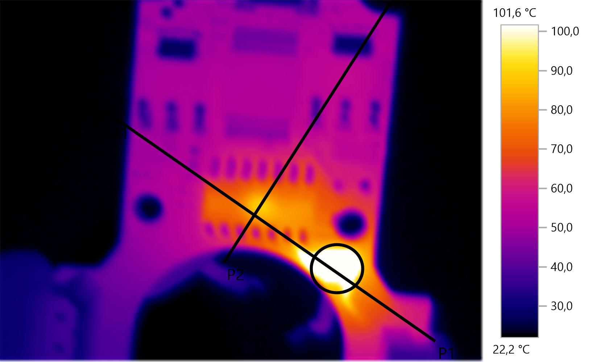
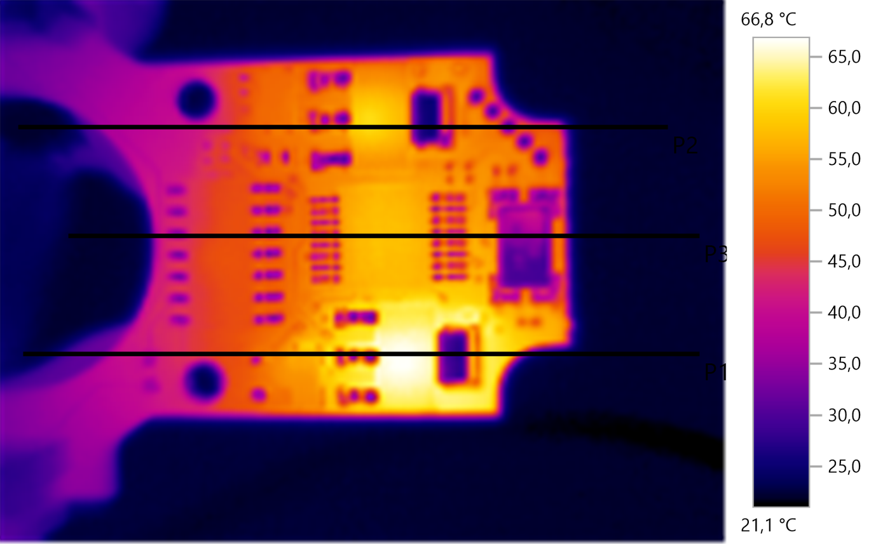

Technisches Wissen zu den Motoren
*********************************

Hier werden Informationen zu den Motoren gesammelt.

Aufbau
======

In den folgenden Abschnitten wird auf die einzelnen Teile des MX-28 eingegangen.

Maxon Motor
-----------

Der eigentliche Motor ist ein `Maxon PN 214897`_ Gleichstrommotor. Er wird über
die Platine gesteuert und ist das Hauptproblem, warum die Motoren mit der Zeit
immer schlechter werden. Warum genau das der Fall ist, wissen wir nicht, aber er
lässt sich mit der Zeit immer schlechter drehen, bis irgendwann gar nichts mehr
geht. Wir vermuten, dass es sich um ein Problem mit der hohen Temperatur
handelt, die beim Betrieb im MX-28 entsteht. Bisher haben wir noch nie versucht
den Motor auszutauschen.

Bilderserie
'''''''''''

Platine
-------

Die eingebaute Platine wird über die serielle TTL Schnittstelle angesprochen und
kümmert sich darum, dass der Motor sich auf die Position bewegt, auf die wir
ihn haben wollen.

Nähere Spezifikation sind bei `Robotis`_ zu finden.

Ein Chip, den wir für einen Spannungswandler halten, wird extrem warm auf der
Platine und erzeugt daher extrem viel Hitze; wir werden versuchen diesen Chip zu
tauschen. Bei Testmessungen (ohne Gehäuse!) wurden um die 80°C gemessen. Es
handelt sich um den großen Chip, der direkt am Motor liegt.

Getriebe
--------

Bei dem Getriebe ist das Problem meist, dass einzelne Zähne abbrechen oder
verkrümmen, wenn der Roboter ungünstig, z.B. auf den Arm, hinfällt. Dies kann
natürlich durch einen Kompletttausch des Getriebes gelöst werden, allerdings
sollte man dabei die Zahnräder, die keinen Schaden haben (mit Lupe untersuchen)
in die entsprechende Tüte für gebrauchte, aber noch funktionstüchtige Zahnräder
packen. Manchmal hilft es auch schon sehr, wenn man einfach ein Zahnrad etwas
dreht, also so, dass nicht mehr die kaputten stellen von zwei Zahnrädern genau
aufeinandertreffen.

Motorhorn
---------

Das Motorhorn wird auf den Ritzel gepresst. An das Motorhorn werden dann die
Metallteile des Darwins befestigt. Man sollte das Motorhorn nicht zu fest drauf
pressen, da sonst der Motor mehr Kraft für das Bewegen braucht. Wenn man den
Motor auseinander nehmen will, muss man das Motorhorn vorher entfernen. Dies ist
nur mit Gewalt möglich. Am besten geht man zur Werkstatt, da die eine
Metallplatte haben, mit der sie recht gut das Horn lösen können. Alternativ kann
man auch in die Löcher gleichmäßig Schrauben drehen, so dass das Horn nach oben
gepresst wird. Dies ist allerdings nicht zu empfehlen, da dabei der Washer
höchstwahrscheinlich zerstört wird.

Washer
------

Liegt zwischen Motorhorn und Gehäuse und sorgt dafür, dass sich kein Schmutz
dazwischen verfängt. Falls keine originalen Washer mehr vorhanden sind, kann man
die Werkstatt fragen. Sie haben schon einmal Washer für uns aus Teflon gemacht
und die waren gut (`siehe Ticket #526`_)

Gehäuse
-------

Das Gehäuse ist aus Plastik und hat keine Öffnungen, damit kein Dreck in dem
Motor landet. Leider lässt es deshalb auch keine Belüftung zu, was dazu führt,
dass es extrem warm wird im Motor. Man könnte überlegen, die Motorgehäuse aus
Metall zu fertigen, weil es besser Wärme ableitet.

.. _Maxon PN 214897: http://www.maxonmotorusa.com/maxon/view/product/motor/dcmotor/remax/remax17/214897
.. _Robotis: http://support.robotis.com/en/product/dynamixel/rx_series/mx-28.htm
.. _siehe Ticket #526: http://redmine.mafiasi.de/issues/526
