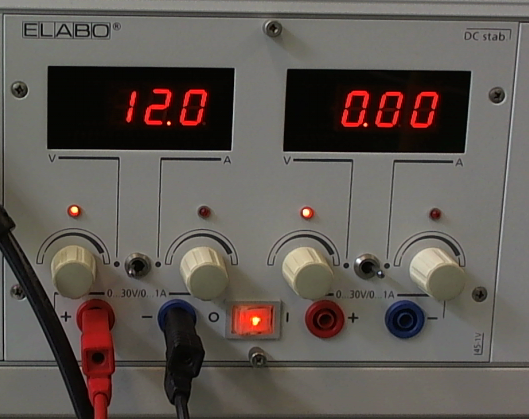

USB2DXL
*******

Der USB2DXL-Adapter verbindet interessanterweise Laptops über USB mit unseren
Dynamixel-Motoren

Anschließen
===========

Es gibt 2 Möglichkeiten:

1. Direkt an einem laufenden Darwin
2. Am Labortisch

Direkt am Darwin
----------------

Einfach einen Darwin starten und den Motor irgendwie (auch transitiv) mit
Motorkabel an den Subcontroller anschließen und das USB2DXL-Tool mit einem
Motorkabel an einen (egal welchen) freien Stecker von einem Motor oder dem
Subcontroller anschließen. Auf den Roboter verbinden und alle laufenden Sachen
schließen, z.B. mit :command:`killall screen`. Den :program:`dxl_monitor` mit
:command:`dxl_monitor` aufrufen und einfach wieder mit dem Befehl
:command:`exit` (NICHT mit *strg+c*) schließen. Die Motoren bekommen jetzt
Strom, bis man den Schalter am Rücken des Roboters drückt.

.. warning::
    Die Motoren werden heiß! Möglichst nicht lange so angeschlossen lassen und
    immer auf die Temperatur achten, da es KEINE automatische Notabschaltung
    gibt.

Am Labortisch
-------------

Material
''''''''

* Rotes Laborstecker-Kabel
* Schwarzes Laborstecker-Kabel
* Krokodilklemmen Rot/Schwarz mit abisolierten Leitern
* Präpariertes Motorkabel (getaggt mit *+,-,Data*)
* Normales Motorkabel
* Motor

Verkabelung
'''''''''''

.. important::
    Immer auf die korrekte Polung achten! Rot zu Rot, Schwarz zu Schwarz/Blau.

1. Die freien Enden der Krokodilklemmenleiter von der Kabel-zugewandten Seite
   her in die Laborstecker schieben, sodass ein Kontakt hergestellt wird.
2. Labortisch anschalten und sicherstellen, dass die Voltzahl korrekt (12V) ist.
3. Strom für die Laborsteckeranschlüsse wieder abschalten (nicht den ganzen
   Tisch)
4. Laborstecker in den Labortisch stecken.
5. Krokodilklemmen an die freien Leiter vom präparierten Motorkabel anschließen.
   Das Kabel ist mit einem **roten +** und einem **blauen -** gekennzeichnet.
   Das Datenkabel wird **nicht** angeschlossen.
6. Präpariertes Motorkabel in den Motor stecken (wo ist egal).
7. Mit normalem Motorkabel den Motor mit dem USB2DXL-Adapter verbinden
8. Sicherstellen, dass der Adapter auf TTL eingestellt ist.
9. Adapter mit USB-Kabel an Laptop anschließen
10. Labortisch anschalten, Motor sollte kurz rot blinken.
11. Nun kann mit entsprechender Software gearbeitet werden.

.. warning::
    Bei Improvisation, wie wir es betreiben, immer auf Kurzschlüsse achten und
    diese unbedingt vermeiden.

Labortisch
''''''''''

.. glossary::

    Volt
        0-30 Volt DC (Gleichstrom) können eingestellt werden.

    Ampere
        Der Tisch liefert bis zu 1A, danach macht die Sicherung Schluss.
        Unser Roboter zieht weitaus mehr, wenn die Motoren an sind!

    Kurzschluss
        Bei Kurzschluss schaltet die Werkbank den Strom automatisch ab.
        Man möchte trotzdem **keinen** verursachen.

* Der jeweils linke Drehregler ist für die Voltzahl
* Der Schalter in der Mitte unten schaltet den Strom für die
  Laborsteckeranschlüsse an und aus
* Das Display zeigt die aktuelle Voltzahl, wenn der Kippschalter zwischen den
  Drehreglern nach links gekippt ist.
* Kippt man den Schalter nach rechts, zeigt das Display die gezogenen Ampere.

.. warning::
    Darauf achten, dass auch Volt ausgewählt ist, wenn man auf Voltzahlen achten
    muss.
