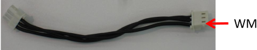
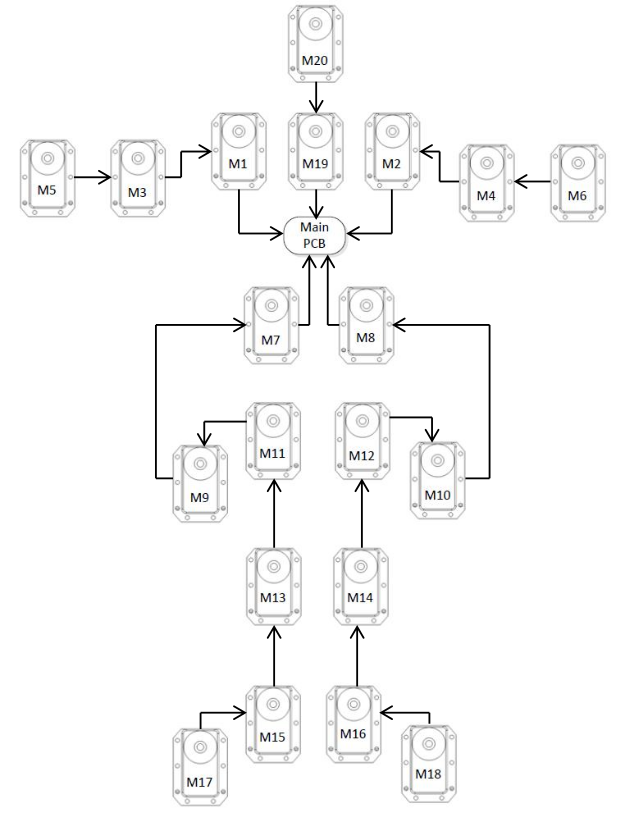

Verkabelung
***********

Bei den Motorkabeln ist es wichtig, dass jeweils ein Kabel mit richtiger Länge
eingebaut wird. Trotz Verwendung der richtigen Kabellänge, neigen die Motorkabel
zum Abnutzen. Daher haben wir auch genügend Ersatzkabel. Diese Seite gibt eine
Schnellübersicht zum Austausch der Kabel. Für eine Gesamtübersicht sollte
jedoch das :download:`Wiring-Manual <downloads/WiringManual.pdf>` aus den
technischen Dokumenten (zu finden auch im Hardware-Ordner) zu Rate gezogen
werden.

Übersichtsplan
==============

Motorkabel Tabelle
==================

.. note::
    Die offizielle Tabelle weist einen Fehler auf. Die Motoren, die laut
    Tabelle mit dem Fit-PC verbunden sind, sind in Wirklichkeit mit dem
    :doc:`CM-730 </hardware/teile/cm730>` zu verkabeln!

Die folgende Tabelle gibt es auch als
:download:`Vektorgrafik <downloads/WireTable.svg>` zum Herunterladen.

========  ====  ======  =======================
Wire No.  From  To      Approximate Length (cm)
========  ====  ======  =======================
WM1       M20   M19     19
WM2       M19   Fit-PC  8
WM1       M1    Fit-PC  10
WM4       M2    Fit-PC  10
WM5       M7    Fit-PC  23
WM6       M8    Fit-PC  17
WM7       M5    M3      5
WM8       M3    M1      18
WM9       M6    M4      5
WM10      M4    M2      18
WM11      M9    M7      13
WM12      M10   M8      13
WM13      M11   M9      6
WM14      M12   M10     6
WM15      M13   M11     18
WM16      M14   M12     18
WM17      M15   M13     25
WM18      M16   M14     25
WM19      M17   M15     6
WM20      M18   M16     6
========  ====  ======  =======================

Steckertypen
============

Wir haben vier Typen von Steckern eingebaut (Molex, 2x JST und einen weiteren
unbekannten).

* Molex Spox (2,5mm Raster): alle die so aussehen wie die Motorstecker
* JST SH (1mm Raster): die flachen Stecker
* JST XH: die Akkustecker
* Unbekannt: der für den Lautsprecher
