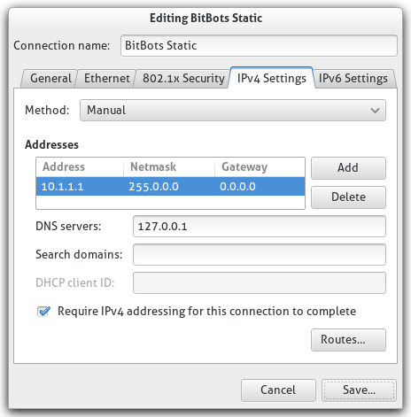

.. _netzwerk:

Netzwerk
========

Wir haben unseren eigenen Server im Labor stehen, der im Labornetz erreichbar ist. Er sorgt für Dinge wie DHCP und die
Musik.
Die Netzwerke ziwschen dem Labor und dem Feldraum sind mit einander verbunden und erscheinen als ein Netzwerk, das
Gleiche gilt für das WLAN.

Unsere Roboter bekommen immer ihre eigenen IPs (192.168.0.1x, mit x = Nummer des Roboters) und sollten auch direkt per
Namen erreichbar sein. Also ein::

    ssh darwin@tamara

sollte funktioniern.

Bei weiteren Fragen Nils (oder zur Not Marc) fragen.
Bitte diese Seite weiter ergänzen!

Direkte Verbindung zum Roboter
------------------------------

Manchmal (insbesondere auf Wetbewerben) kann es vorkommen, dass man sich mit seinem Laptop direkt auf den Roboter
verbinden muss. Um sich mit einem Netzwerkkabel direkt mit dem Roboter zu verbinden
und agieren zu können wie oben beschrieben, muss man zunächst eine
``WiredConnection`` hinzufügen. In der Grafik sind auch schon die
richtigen Werte abgebildet, die eingetragen werden müssen.

Anschließend muss man ``dnsmasq`` installieren::

    sudo apt-get install dnsmasq

Um das ganze zu nutzen, kopiert man sich aus dem :ref:`git` unter dem Ordner
``infrastruktur/netzwerkstuff`` die dnsmasq.conf und kopiert sie unter
``/etc/dnsmasq.conf``. In der ``dnsmasq.conf`` muss eventuell noch das
Interface (z.B. eth0) auf das des Laptops gestellt werden!

Um nun das ganze zu starten, verbindet man das Netzwerkkabel zwischen
Roboter und Laptop und verbindet sich mit der zuvor erstellten
Netzwerkverbindung. Nun noch den ``dhcp`` starten::

    sudo dnsmasq -d

.. todo::
  Erklärung der Netzwerk-Infrastruktur schreiben
