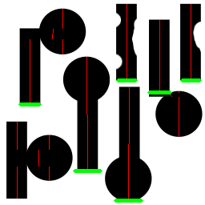

ShapeVector essentials
======================
Last-minute Doku für den ShapeVector Krams.
(Pylonerkennung, Hinderniserkennung)

ShapeVector?
------------

Der Name den ich (Timon) mir schnell ausgedacht habe für das womit ich rumspiele, weil mir kein besserer einfällt. 

Aus einem Binärbild werden nach bestimmten Regeln (zeilenweise) Vektoren gebaut. Jeder dieser Sogenannten ShapeVectors repräsentiert einen zusammenhängenden Feature-Teil des Bildes. 

Ein ShapeVector hat folgende Komponenten:

.. cpp:type:: struct ShapeVector 

  .. cpp:member:: int sx

    startpoint x-coordinate

  .. cpp:member:: int sy

    startpoint y-coordinate

  .. cpp:member:: int ex 

    endpoint x-coordinate

  .. cpp:member:: int ey

    endpoint y-coordinate

  .. cpp:member:: int weight 

    Number of pixels this vector represents

  Der Endpunkt liegt garantiert tiefer als der Startpukt.

  .. hint:: 

    Die vorstufe von ShapeVectors sind die figVecs in der *simple_vectorizer*
    Diese bieten u.a. noch die komponente *slope* an, die "Steigung" welche der
    Vektor besitzt. Falls das irgendwann gebraucht wird wäre es nicht schwierig
    da ran zu kommen. 

Vereinfacht kann man sich den Shape-Vector auch als ein Rechteck mit Ausrichtung vorstellen.

  Beispiel für ShapeVectors in einer komplexen Figur

Getter
^^^^^^
die Vision kann die gefundenen ShapeVector zurückgeben. 

Entweder in python:
"""""""""""""""""""

.. py:function:: RobotVision.get_shape_vectors()

  Gibt die im letzten Frame gefundenen vektoren zurück.

  :return: list von 5-Tuples der komponenten von :cpp:type:`ShapeVector`

Oder in c++:
""""""""""""

.. cpp:function:: const std::list<ShapeVector>& get_shape_vectors() const 

  Analog gibt das hier eine std::list mit den ShapeVectors zurück.

Was kann man damit machen?
--------------------------

Vorerst: Falls man nichts besseres hat kann man die Vektoren nehmen und als Hindernisse interpretieren. Dazu würde ich überprüfen ob der Vektor auf dem Feld endet, weight/vektorlänge wäre eine approximation der Größe des Bildausschnittes die das Hindernis einnimmt. 

In der Zukunft will ich die Information von mehreren Vektoren versuchen zu kombinieren um bestimmte Objekte erkennen zu können, aber momentan kann man das knicken. 

Pylonerkennung
--------------

Die aktuelle rudimentäre Pylonerkennung sucht einfach in der Liste der figVecs nach Vektoren die als Pylon in Frage kommen.
Dabei werden Verhältnis von Breite zu Höhe, abweichung von optimaler Ausrichtung, und eingenommene Fläche (darf nicht zu klein sein) überprüft.

Überdeckungsprobleme
^^^^^^^^^^^^^^^^^^^^

  
  Überdeckung an Pylonen 

  | Verschiedene Überdeckungsszenarien an Pylonen.
  | Die Grünen Linien markieren erkannte Pylone.

  Große Überdeckungen am Vektorbeginn 

  | Momentan führt eine starke änderung der Breite 
  | nicht zu einem neuen Vektoranfang.

  So sollte es im Idealfall laufen

Verdeckung mit anderen Schwarzen Objekten wirkt sich sehr negativ aus, verdeckung durch "helle" objekte kann teilweise ausgeglichen werden.
Grundsätzlich ist das Matching aufgeschmissen wenn der vertikale ShapeVektor aus irgendeinem Grund auseinander gerissen wird. Überlagerungen am Oberen und Unteren Ende wirken sich weitaus weniger negativ aus als Überlagerungen im der vertikalen Mitte. 

Datentyp
^^^^^^^^

Pylone werden in c++ über das Struct Pylon zu finden in der *simpe_vectorizer.hpp* definiert.

.. cpp:type:: struct Pylon
  
  .. cpp:member:: int x
    
    Die x position auf dem Bild

  .. cpp:member:: int y

    Die y position auf dem Bild

  .. cpp:member:: int radius

    Die halbe breite des Pylons
    (Fällt tendenziell etwas geringer aus als real)

Getter
^^^^^^

  Die Pylonen bekommt man von der RobotVision.

Python 
""""""
.. py:function:: RobotVision.get_pylons()

  Gibt alle Pylonen zurück die im letzten Frame gefunden wurden.

  :return: list of 3-Tupel containing the components of :cpp:type:`Pylon`

c++
"""

.. cpp:function:: const std::list<Pylon>& get_pylons() const 

  Gibt eine std::list von :cpp:type:`Pylon` zurück.

Binarizing 
----------

Die gesamte ShapeVector generierung ist nur so gut wie das Binärbild das rein geht.

.. important::

  Je homogener das Binärbild ausfällt um so besser das Ergebnis und die Laufzeit.

Derzeit gibt es nur eine einfache Threshold basierte umwandlung direkt aus dem jeweiligen frame heraus.
Dabei wird nur jeder :c:data:`SKIP` -te pixel betrachtet, da die Vektorisierung recht wenig Auflösung benötigt.

Dafür gibt es zwar die binariser.cpp in der zwei billige Funktionen zum binarisieren von bildern vorhanden sind, inzwischen läuft das aber "on the fly" direkt in der Vision::process_shapeVectors() 

Dabei wird ausschließlich der Helligkeitswert(V) aus jedem betrachteten HSV-Pixel gegen einen THRESHOLD verglichen. Bei meinen Tests im Vorfeld hatte ich RGB-Bilder und habe mir dort nur den Grünkanal angeguckt (weil dort spielfeld und linien hell erscheinen - Roboter, Pylone etc. sehr dunkel). Ich habe das ungeprüfte Gefühl dass es mit HSV einen Tick schlechter funktioniert als mit RGB. 

Inzwischen werden die Pixel-werte relativ performant ohne eine Umwandlung verglichen.
Dabei gucke ich mir entweder den V-Kanal von HSV oder den zweiten y-kanal von yuyv an.
Das hat den Vorteil der geschwindigkeit, 
ein Nachteil könnte sein dass ich die Farbwerte nicht berücksichtige. 
Möglicherweise kann man die erkennung "schwarzer" objekte (wie Roboter) verbessern indem man Pixel rausschmeißt die zwar dunkel, aber sehr "farbig" sind. Vorerst sind die Ergebnisse aber ganz brauchbar. 

Eine bessere Vorverarbeitung die die Pixel in feature (0)  und nicht-feature (255) einteilt ohne dass "Löcher" in der zu erkennenden Form auftreten wäre cool, haben wir aber gerade nicht.

Parameter zum dran rumspielen
-----------------------------
Meine Parameter werden zur Compile-Zeit festgelegt.

Vor dem Vektorisieren
^^^^^^^^^^^^^^^^^^^^^

Paramerter in *robotvision.hpp*

.. c:var:: int SKIP 

  Wie stark der Frame für die Binarisierung verkleinert wird. 
  Momentan steht :c:data:`SKIP` auf 5. 
  Damit wird nur jede 5te Zeile und jede 5te Spalte der Bildmatrix betrachtet.

  Logischerweise Bedeutet eine Erhöhung bessere Performance. 
  Den Parameter niedriger machen bedeutet allerdings nicht zwangsläufig ein 
  besseres Ergebnis. 
  Stichwort ist die Homogenität des Binärbildes - eine höhere Auflösung erhöht  bei der Verwendung einer simplen Threshold-Binarisierung die Chance dass sich irgendwo in einem dunklen Bereich ein heller Pixel einschleicht, welcher die ShapeVectors zerschießen würde. 

  .. hint:: 

    Die Daten die in den fertigen ShapeVectors landen werden vorher wieder auf
    die Größenmaße des Frames hochskaliert.
  
  .. warning:: 
    
    Die Parameter in der Vektorgenerierung sind von der Bildgröße abhängig. 
    Wird SKIP verändert, so müssen die Parameter in der Vektorisierung ggf.
    angepasst werden.

.. c:var:: int V_THRESHOLD

  Schwellwert für die Binarisierung.
  Je besser dieser Wert gesetzt ist umso klarer wird das Binärbild und desto weniger fragmentiert sind die Vektoren nach der verarbeitung.
  Das verbessert sowohl Ergebnis als auch Laufzeit.

Beim Vektorisieren
^^^^^^^^^^^^^^^^^^

Parameter in  *simple_vectorizer.cpp*

.. c:var:: double MAX_PENALTY 

  Gibt an wie weit ein Vector von seiner ursprünglichen Steigung (durch die ersten 2 punkte festgelegt) abweichen darf, bevor ein neuer angefangen wird. 
  Ein höherer Wert dürfte zu mehr erkannten Pylonen führen

.. c:var:: int MAX_DIST

  Vektoren werden nur dann erweitert wenn ein neuer Punkt nicht um mehr als diese Distanz auf der x-achse vom endpunkt abweicht. 
  Es besteht vermutlich kein Anlass diesen Wert zu ändern. Ein höherer Wert würde möglicherweise zu mehr erkannten Pylonen, aber wahrscheinlich auch zu mehr Problemen führen.

.. c:var:: int MIN_RELEVANCE

  Fertige Vektoren die weniger Pixel haben als MIN_RELEVANCE werden weggeworfen. 

  .. warning::   

    Die Pixelzahl bezieht sich auf den zustand im vectoriser 
    (das bild wurde ja mit SKIP auf weniger Pixel runter gerechnet)
    Wenn also SKIP verändert wird, so sollte man diesen Parameter 
    ebenfalls anpassen.

Beim Pylon suchen
^^^^^^^^^^^^^^^^^

Parameter in  *simple_vectorizer.cpp*

.. c:var:: double FACTOR

  A vector must be FACTOR times higher than wide to qualify as a Pylon

.. c:var:: double MAX_SLOPE

  maximale Steigung des Vektors, Vektoren die stärker gedreht sind, sind keine Pylonen.

.. c:var:: double MIN_SLOPE

  minimale Steigung des Vektors, Vektoren die stärker gedreht sind, sind keine Pylonen.

.. c:var:: int MIN_LENGTH

  Anything that is less pixel in height is thrown away.

.. c:var:: int MIN_WIDTH

  Anything that is less pixel in width is thrown away.

Testen
------

Sofern eine Webcam vorhanden ist kann man ::

    bin/vision

ausführen, sofern die privaten Variablen *shapeVectors_enabled* sowie *pylons_enabled* in der Robotvision gesetzt sind.

Die dunkelblauen "striche" im ausgabebild sind gefundene ShapeVectors.
Befindet sich am unteren Ende eines Vektors ein horizontaler roter Strich, so ist dieser ein erkannter Pylon. 
Die länge des roten Striches entspricht der vermuteten breite des Pylons. 

An den Logger wird außerdem noch die Anzahl der jeweils gefundenen Pylone geschickt. 
