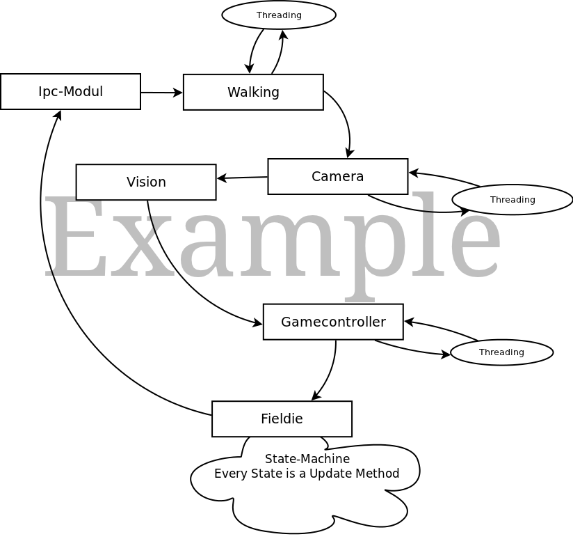

Architecture at Runtime
=======================

Example: Modules at Runtime
---------------------------

In the left graphic you can see an example setting of a running program as it is for example done by the scripts
**start-fieldie** or **start-goalie**.

| In particular you can see the modules which are executed one after another (indicated by the arrows between the squares).
| There are in general three kinds of modules:

1. Simple Modules
^^^^^^^^^^^^^^^^^
        The Simple Modules you can see as squares in the graphic without any other arcs then the
        ones from the last and to the next module. They contain a simple function :func:`update` which is
        called every time the module is called.

2. Threaded Modules
^^^^^^^^^^^^^^^^^^^
        The Threaded Modules have a thread assigned to them which is running the whole time in background.
        The method :func:`update` is therefore used to synchronize the data which is written and read to/from the
        data dictionary.

3. Statemachines
^^^^^^^^^^^^^^^^
        At the statemachines every state is like an :func:`update` method itself. So depending on the state
        the statemachine is in other code fragments are executed.

General Execution Flow
----------------------

In a Start Script there are at first listed the packages which contains the modules which are at a later point of time are laoded.::

    IMPORTS = [ "bitbots.modules.basic", "darwin.modules.tracking", "darwin.modules.fieldie", ...]

After that the modules which are required are given as parameters for the function :func:`run`. By analyzing the given modules and reading the values which are required and which are provided
a dependency graph is created. There is also the possibility that modules are loaded because else a requirement is not met. Then the update method of each module is called in a while-loop
until the program terminates.::

    runtime.run([ "FieldieModule", "BallTrackingModule", "Speaker", ..., "Walking"])

Documentation of the Runtime-Class
----------------------------------

.. automodule:: bitbots.framework

